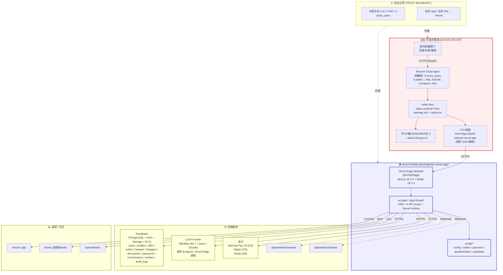
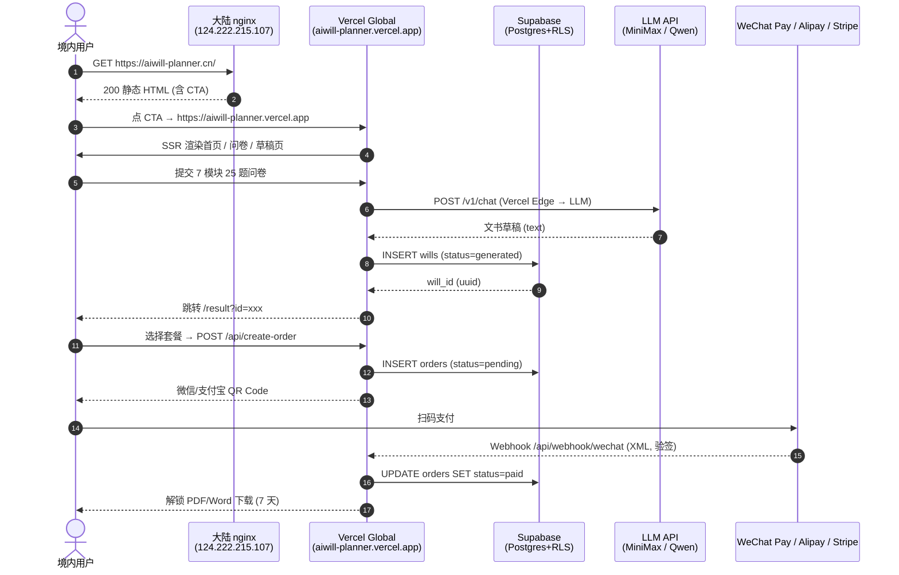
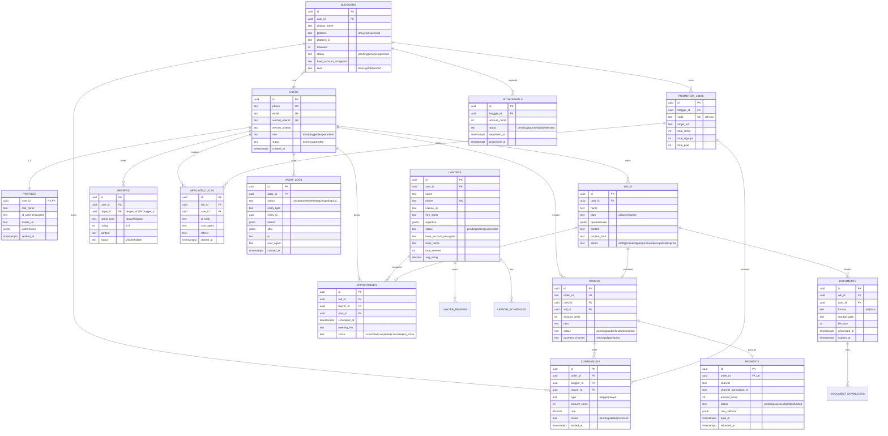
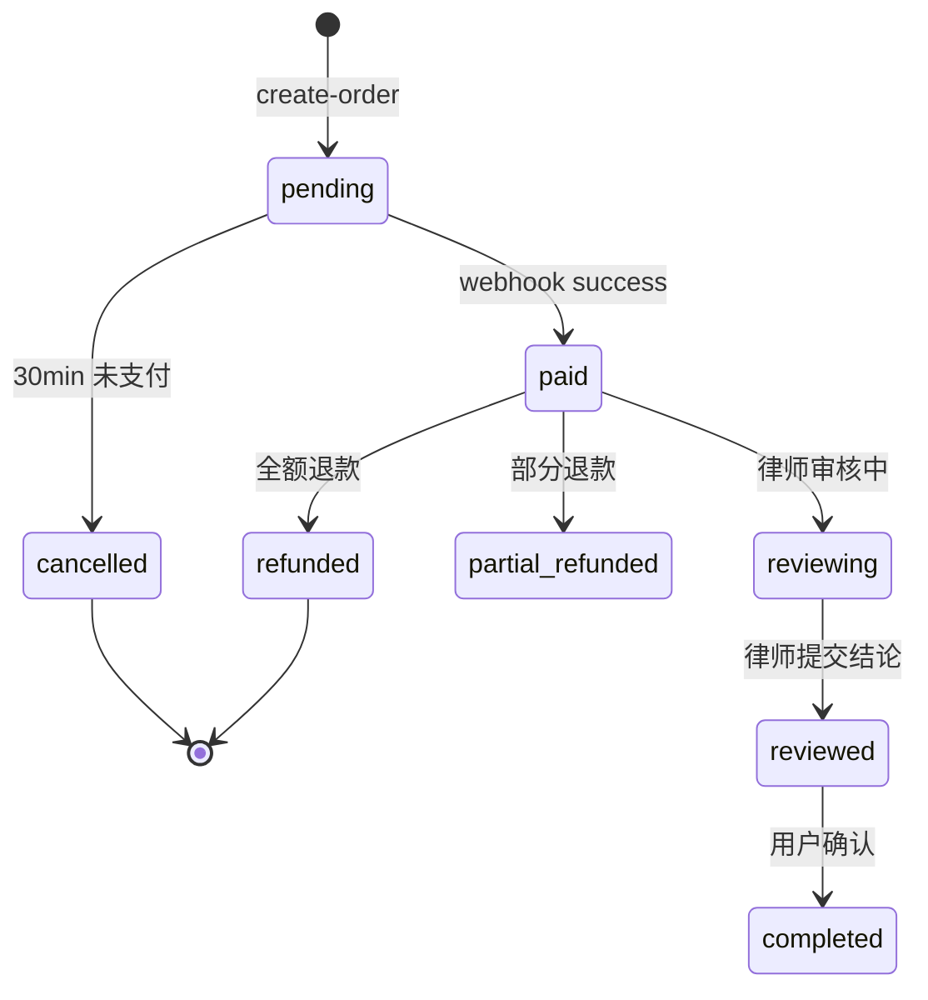
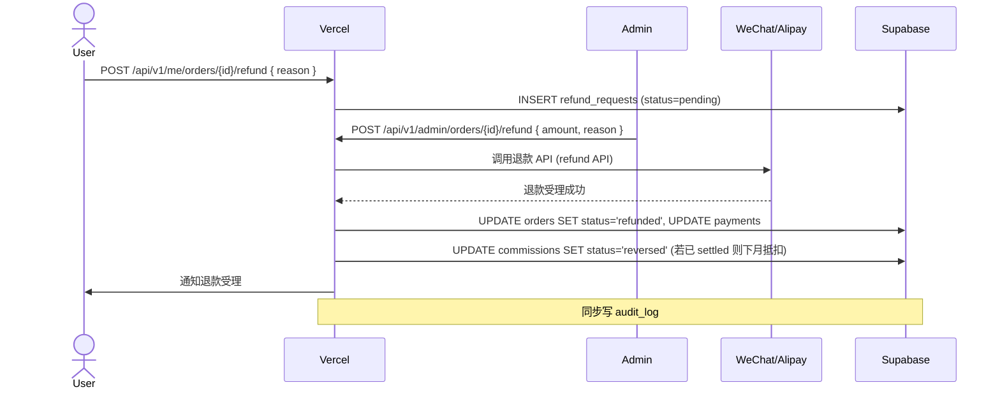
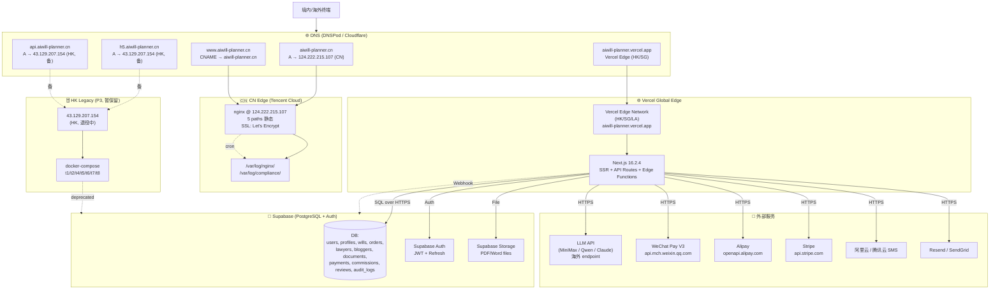
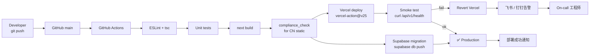

# aiwill-planner · 架构文档 (Architecture Document)

> 项目：爱的延续 · AI 人生规划平台 (aiwill-planner)
> 文档版本：v1.0
> 编制日期：2026-06-02
> 编制者：Technical Architect
> 状态：评审稿 · 提交 Master Agent
> 母文档：`docs/PRD.md` v1.0（Product Designer）
> 参考文档：合并执行版.docx · 合规手册.docx · 现状分析与优化建议.docx · aiwill-planner_Guide.docx · README.md · FIX_PLAN.md

---

## 0. 文档目的与边界 (Purpose & Scope)

本文档是 aiwill-planner 的 **整体系统架构基线**，回答以下 12 个问题：
1. 系统的 **双部署拓扑** 如何划分与隔离？
2. 各个 **技术栈** 选型理由？
3. **目录结构** 应如何组织？
4. **数据模型** 在现有 `supabase-schema.sql` 基础上如何扩展？
5. **API 设计** 在 `src/app/api/*` 下如何布局？
6. **认证 / 授权** (Auth / RLS) 如何落地？
7. **支付集成** (Stripe / WeChat / Alipay) 怎么打通？
8. **博主分佣** 怎么追踪与结算？
9. **安全合规** (ICP / PIPL / AI 法规 / 律师执业 / 加密 / Secrets) 怎么满足？
10. **部署拓扑** (CN nginx + Vercel + Supabase + DNS) 怎么联动？
11. 从 **现状** (t9-h5-frontend 移除 / HK 退役) 怎么迁移到目标态？
12. **待决问题** (multi-tenant vs single / 订阅 vs 一次性 / 小程序优先级) 怎么定？

**本文档不实现代码**，仅为 Developer Agent / DevOps Agent 提供蓝图。代码改动应严格遵循本文档并由 Developer Agent 在独立回合执行。

---

## 1. 系统架构图 (System Architecture)

### 1.1 双部署信任边界总览



### 1.2 核心数据流 (Core Data Flow)



### 1.3 信任边界与合规红线 (Trust Boundaries)

| 边界 | 大陆侧 | Vercel 侧 | 互操作 |
|------|--------|-----------|--------|
| **网络层** | 不允许 `proxy_pass` 到境外 IP | 不向大陆 IP 反向推送内容 | 仅通过浏览器跨域跳转 |
| **应用层** | 零 JS 框架、零 `fetch()`、零 `/api/*` | 完整 SaaS、6 API + Server Actions | 浏览器 DNS 跳转，无服务端调用 |
| **数据层** | 不落任何用户数据 | 全部业务数据在 Supabase | — |
| **AI 边界** | 0 AI 字符串 (grep 验证) | LLM 调用走 Vercel Edge → 海外 LLM | 不跨境直连 |
| **支付边界** | 不放支付链接 | 走 WeChat Pay V3 / Alipay / Stripe | 二维码扫码，浏览器跳支付 App |
| **审计边界** | 部署时 `compliance_check.sh` 7 项 | Vercel Logs + Sentry + 审计日志表 | — |

---

## 2. 技术栈选型 (Tech Stack & Rationale)

### 2.1 选型总览 (Stack Matrix)

| 层 | 选型 | 版本 | 角色 | 理由 |
|----|------|------|------|------|
| **CN 静态站** | nginx + 纯 HTML/CSS/JS | nginx 1.24+ | 静态文件服务器 | 零依赖、合规、CDN 友好、低成本 |
| **Web 框架** | Next.js | 16.2.4 | Vercel 全栈框架 | App Router + Server Actions + Edge Runtime |
| **UI 库** | React | 19.2.4 | 视图层 | Next.js 默认；服务器组件减小 bundle |
| **样式** | Tailwind CSS | v4 | 工具类 CSS | 编译后体积小；不依赖 JS 即可显示 |
| **包管理** | npm | 10+ | 依赖管理 | Vercel 默认支持 |
| **后端 (Vercel)** | Next.js API Routes | 16.2.4 | 业务 API (BFF 层) | 与前端同仓库，减少运维 |
| **数据库** | Supabase (PostgreSQL) | latest | 主业务数据 | RLS 原生、内置 Auth、迁移友好 |
| **认证** | Supabase Auth | latest | JWT + OAuth | 集成 RLS；支持手机号 OTP、微信 OAuth |
| **对象存储** | Supabase Storage | latest | PDF/Word 文件 | 与 RLS 联动、签名 URL |
| **LLM 推理** | MiniMax M2.7 (现) → 多供应商 | — | 文书草稿生成 | 海外 endpoint；fallback 模板保证可用性 |
| **国内支付** | WeChat Pay V3 + Alipay | — | 微信/支付宝扫码 | 商户号合规；退款原路返回 |
| **国际支付** | Stripe | — | 海外华人信用卡 | Webhook 签名验证 |
| **CDN** | Vercel Edge (海外) + 阿里云 CDN (大陆可选) | — | 静态加速 | 大陆 CDN 需 ICP 一致主体 |
| **邮件** | Resend / SendGrid | — | 草稿邮件投递 | 草稿生成后通知 (P2) |
| **短信** | 阿里云 / 腾讯云 SMS | — | 验证码 + 通知 | 国内手机号合规 |
| **监控** | Sentry (前后端) + UptimeRobot | — | 错误 + uptime | 免费层起步，按需升级 |
| **日志** | Vercel Logs + Supabase Logs | — | 运行审计 | 7 年留存 (PIPL) |
| **CI/CD** | GitHub Actions → Vercel | — | 自动部署 | main 推送即生产 |
| **Secrets** | Vercel Env + GitHub Secrets | — | 密钥管理 | 永不入库；轮转周期 90 天 |
| **TS 校验** | TypeScript (ignoreBuildErrors 暂开) | 5.x | 类型 | 后续开启严格模式 |

### 2.2 不选 / 暂不选 (Out of Stack)

| 候选 | 现状 | 不选理由 |
|------|------|----------|
| Vue / Nuxt | — | Next.js 已是主框架，迁移成本高 |
| Redis | — | T1/T4 Go 服务硬约束「禁止 Redis」 |
| Kafka / RabbitMQ | — | T1/T4 Go 服务硬约束「禁止共享 MQ」 |
| 自建 K8s | 已有 `deployment/k8s/*` 模板 | HK 节点单 VM 跑 Docker Compose 已足够 |
| 阿里云函数计算 | — | Vercel 已覆盖 Serverless；引入会增复杂度 |
| 小程序原生 WXML | — | T8 miniprogram 是 Go 后端 + WXML 前端；先 P3 |

### 2.3 关键选型理由 (Key Decisions)

1. **Supabase 而非自建 PG + Auth0**
   - RLS 与 Auth 一体，省去「应用层加鉴权」易错点
   - 免费层 500MB / 50k MAU 起步，超额升级 Pro $25/月可控
   - 直接支持 WeChat OAuth（需在 Supabase Auth 配置）

2. **Next.js 16.2.4 而非 NestJS / Express**
   - 与前端同仓库、Server Actions 减少 BFF 代码
   - Vercel 原生支持，自动 Edge Runtime
   - 团队 React 技能可复用

3. **WeChat Pay V3 (JSON+SHA256) 而非 V2 (XML+MD5)**
   - V3 签名更安全（RSA）
   - 文档更清晰、社区更活跃
   - 2026 年 V2 仍可用，但官方推荐 V3

4. **LLM 走海外 endpoint (MiniMax / Qwen-Intl)**
   - 严守「大陆节点 0 AI」合规底线
   - 备选 DeepSeek / Claude / OpenAI；多供应商容灾

5. **审计日志 append-only (PostgreSQL trigger)**
   - PIPL 7 年留存要求
   - 阻断 UPDATE/DELETE，仅 INSERT

---

## 3. 目标目录结构 (Target Directory Structure)

> 与现状的差异标注 **(新)** / **(改)** / **(保留)**

```
aiwill-planner/
├── README.md
├── FIX_PLAN.md                                  # 上线修复执行报告 (保留)
├── MVP-快速验证方案.md
├── package.json                                 # Next.js 16.2.4 依赖
├── package-lock.json
├── tsconfig.json
├── next.config.ts                               # Next.js 配置 (ignoreBuildErrors: true 暂保留)
├── eslint.config.mjs
├── postcss.config.mjs
├── .gitignore
├── .git/
│
├── docs/                                        # 📚 文档中心
│   ├── PRD.md                                   # 产品需求 (Product Designer 出)
│   ├── ARCHITECTURE.md                          # 本文档 (Technical Architect 出)
│   ├── api.md                                   # Go 微服务 API (保留)
│   ├── OPERATION_MANUAL.md                      # 运维手册
│   ├── OPTIMIZATION_REPORT.md                   # 优化报告
│   ├── ADR/                                     # (新) Architecture Decision Records
│   │   ├── 0001-two-tier-deployment.md
│   │   ├── 0002-supabase-over-self-hosted-pg.md
│   │   └── 0003-remove-t9-h5-frontend.md
│   ├── compliance/                              # (新) 合规证据归档
│   │   ├── evidence-2026-06-XX/
│   │   └── icp-survey/
│   └── runbooks/                                # (新) 应急响应 SOP
│       ├── wechat-pay-outage.md
│       ├── supabase-outage.md
│       └── vercel-outage.md
│
├── src/                                         # Next.js 业务应用
│   ├── app/
│   │   ├── layout.tsx                           # 全站 layout (含 <LegalFooter/>)
│   │   ├── globals.css
│   │   ├── page.tsx                             # 首页
│   │   ├── login/                               # (新) 登录
│   │   ├── register/                            # (新) 注册
│   │   ├── questionnaire/                       # 7 模块 25 题问卷
│   │   ├── result/                              # 草稿预览
│   │   ├── payment/                             # 订单支付
│   │   ├── orders/                              # 我的订单
│   │   ├── blog/                                # (新 P2) 博客
│   │   ├── lawyers/                             # (新 P1) 律师目录
│   │   ├── affiliate/                           # (新 P1) 博主合作页
│   │   ├── legal/                               # (新) 服务条款 / 隐私
│   │   ├── help/                                # (新) 帮助中心
│   │   ├── me/                                  # (新 P1) 用户中心
│   │   │   ├── orders/
│   │   │   ├── documents/
│   │   │   ├── appointments/
│   │   │   ├── affiliate/
│   │   │   └── settings/
│   │   ├── lawyer/                              # (新 P1) 律师端
│   │   │   ├── dashboard/
│   │   │   ├── queue/
│   │   │   ├── review/[id]/
│   │   │   ├── schedule/
│   │   │   ├── earnings/
│   │   │   └── profile/
│   │   ├── affiliate/                           # (新 P1) 博主端 (与上面合作页不同)
│   │   │   ├── dashboard/
│   │   │   ├── links/
│   │   │   ├── content/
│   │   │   ├── earnings/
│   │   │   └── withdraw/
│   │   ├── admin/                               # (新 P1) 管理端
│   │   │   ├── page.tsx                         # 概览
│   │   │   ├── orders/
│   │   │   ├── refunds/
│   │   │   ├── lawyers/
│   │   │   ├── affiliates/
│   │   │   ├── users/
│   │   │   ├── templates/
│   │   │   ├── content/
│   │   │   ├── audit/
│   │   │   ├── compliance/                      # 7 项证据面板
│   │   │   ├── finance/
│   │   │   └── settings/
│   │   └── api/                                 # RESTful API (见 §5)
│   │       ├── auth/
│   │       │   ├── login/route.ts
│   │       │   ├── register/route.ts
│   │       │   ├── logout/route.ts
│   │       │   └── callback/route.ts            # 微信/邮箱回调
│   │       ├── me/route.ts
│   │       ├── generate-will/route.ts           # ✅ 已有
│   │       ├── create-order/route.ts            # ✅ 已有
│   │       ├── orders/[orderId]/route.ts        # ✅ 已有
│   │       ├── book-lawyer/route.ts             # ✅ 已有
│   │       ├── payment/
│   │       │   ├── route.ts                     # ✅ 已有 (initiate)
│   │       │   ├── callback/route.ts            # ✅ 已有 (wechat/alipay)
│   │       │   └── status/route.ts              # ✅ 已有
│   │       ├── lawyers/
│   │       │   ├── route.ts
│   │       │   └── [id]/route.ts
│   │       ├── affiliate/
│   │       │   ├── apply/route.ts
│   │       │   ├── links/route.ts
│   │       │   ├── me/route.ts
│   │       │   └── earnings/route.ts
│   │       ├── admin/
│   │       │   ├── stats/route.ts
│   │       │   ├── orders/route.ts
│   │       │   ├── lawyers/route.ts
│   │       │   ├── affiliates/route.ts
│   │       │   ├── templates/route.ts
│   │       │   ├── audit/route.ts
│   │       │   └── finance/export/route.ts
│   │       └── webhook/
│   │           ├── wechat/route.ts              # (新 P0)
│   │           ├── alipay/route.ts              # (新 P0)
│   │           └── stripe/route.ts              # (新 P0)
│   ├── components/                              # 共用组件
│   │   ├── LegalFooter.tsx                      # ✅ 已有
│   │   ├── Navbar.tsx                           # (新)
│   │   ├── DocumentCard.tsx                     # (新)
│   │   ├── PricingTable.tsx                     # (新)
│   │   ├── Questionnaire/                       # (新)
│   │   │   ├── ProgressBar.tsx
│   │   │   ├── QuestionRenderer.tsx
│   │   │   └── ModuleNav.tsx
│   │   ├── Payment/                             # (新)
│   │   │   ├── QrCodeModal.tsx
│   │   │   └── PaymentStatusPoll.tsx
│   │   └── ui/                                  # 原子组件
│   │       ├── Button.tsx
│   │       ├── Input.tsx
│   │       └── Modal.tsx
│   ├── lib/                                     # 业务逻辑
│   │   ├── config.ts                            # ✅ 已有 (env 集中)
│   │   ├── supabase.ts                          # ✅ 已有 (anon client)
│   │   ├── supabase-server.ts                   # ✅ 已有 (admin client)
│   │   ├── supabase-types.ts                    # (新) 自动生成 DB types
│   │   ├── auth.ts                              # (新) Supabase Auth 封装
│   │   ├── rls.ts                               # (新) RLS 策略 helper
│   │   ├── orders.ts                            # ✅ 已有 (CRUD + Supabase)
│   │   ├── payment.ts                           # ✅ 已有 (channel 抽象)
│   │   ├── wechat-pay.ts                        # (新 P0) 微信 V3 真实接入
│   │   ├── alipay.ts                            # (新 P0) 支付宝真实接入
│   │   ├── stripe.ts                            # (新 P0) Stripe 接入
│   │   ├── questionnaire.ts                     # ✅ 已有 (7模块25题配置)
│   │   ├── llm.ts                               # (新) LLM 抽象层 (多供应商)
│   │   ├── affiliate.ts                         # (新 P1) 博主分佣计算
│   │   ├── document-renderer.ts                 # (新 P1) 调 t7 渲染 PDF/Word
│   │   ├── audit.ts                             # (新 P1) 审计日志写入
│   │   ├── compliance-check.ts                  # (新 P1) 合规自检 (客户端版)
│   │   └── validation/                          # (新)
│   │       ├── id-card.ts
│   │       └── phone.ts
│   ├── types/                                   # TS 类型
│   │   ├── order.ts
│   │   ├── will.ts
│   │   └── user.ts
│   └── middleware.ts                            # (新) Next.js middleware (auth 守卫)
│
├── static-content/                              # CN 静态页 (直接被 nginx 服务)
│   ├── faq.html
│   ├── tutorial.html
│   ├── compare.html
│   └── tool.html
│
├── index.html                                   # CN 静态首页
│
├── supabase/                                    # (新) Supabase 项目
│   ├── schema.sql                               # 从根目录 supabase-schema.sql 移入
│   ├── migrations/                              # (新) 版本化迁移
│   │   ├── 0001_init_wills_orders_lawyers.sql
│   │   ├── 0002_add_payments.sql
│   │   ├── 0003_add_bloggers_commissions.sql
│   │   ├── 0004_add_documents_reviews.sql
│   │   ├── 0005_add_audit_logs.sql
│   │   └── 0006_rls_policies.sql
│   ├── seed.sql                                 # (新) 开发种子
│   └── functions/                               # (新) Edge Functions (可选)
│       └── wechat-callback/index.ts
│
├── deployment/                                  # 部署配置
│   ├── mainland-server/                         # CN 部署 (P0)
│   │   ├── nginx.conf                           # ✅ 已有 (合规收紧)
│   │   ├── deploy_mainland.sh                   # ✅ 已有
│   │   ├── compliance_check.sh                  # ✅ 已有
│   │   ├── sitemap.xml
│   │   ├── robots.txt
│   │   ├── ssl/                                 # (新) Let's Encrypt 证书
│   │   │   ├── fullchain.pem
│   │   │   └── privkey.pem
│   │   └── crontab.example                      # (新) 每月 1 日 0 点合规自检
│   ├── hk-server/                               # HK (Vercel 兜底, 暂保留但功能降级)
│   │   ├── nginx.conf                           # ✅ 保留作历史
│   │   ├── deploy_h5.sh                         # ✅ 保留
│   │   ├── deploy.sh
│   │   ├── docker-compose.yml
│   │   ├── .env.example
│   │   └── README.md
│   ├── vercel/                                  # (新) Vercel 配置
│   │   ├── vercel.json                          # rewrites / headers / redirects
│   │   ├── .env.example
│   │   └── README.md
│   ├── k8s/                                     # (保留) 备用 K8s 模板
│   │   ├── 00-namespace.yaml
│   │   ├── 01-*.yaml
│   │   └── ingress.yaml
│   ├── dockerfiles/                             # Go 微服务 Docker
│   │   ├── Dockerfile.t1-compliance-engine
│   │   ├── Dockerfile.t2-api-gateway
│   │   ├── Dockerfile.t4-contract-generator
│   │   ├── Dockerfile.t5-membership
│   │   ├── Dockerfile.t6-affiliate
│   │   ├── Dockerfile.t7-document-renderer
│   │   ├── Dockerfile.t8-miniprogram
│   │   └── Dockerfile.t9-h5-frontend           # (历史保留, 不再构建)
│   ├── docs/                                    # 部署文档
│   └── scripts/                                 # (新) 通用运维脚本
│       ├── rotate-secrets.sh
│       ├── backup-supabase.sh
│       └── verify-dns.sh
│
├── .github/
│   └── workflows/
│       ├── deploy.yml                           # ✅ 已有 (Vercel 部署)
│       ├── compliance.yml                       # (新) 每次 PR 跑 compliance_check
│       └── e2e.yml                              # (新 P2) Playwright E2E
│
├── tests/                                       # 集成测试
│   ├── api/                                     # (新) API 集成测试
│   ├── e2e/                                     # (新) Playwright
│   └── fixtures/
│
├── t1-compliance-engine/                        # Go 微服务 (历史, K8s 模板保留)
├── t2-api-gateway/
├── t4-contract-generator/
├── t5-membership/
├── t6-affiliate/
├── t7-document-renderer/
├── t8-miniprogram/
├── t9-h5-frontend/                              # ⚠️ 已在 commit a22a9ae 移除 (Vercel 替代)
├── t10-pc-admin/                                # (新) Admin 后台 (Vue/React + Go API)
│
├── docker-compose.yml                           # 全栈 docker-compose (HK 备用)
├── aiwill_douyin_bloggers_list.md               # 商务资料 (保留)
├── aiwill_douyin_promotion_plan.md
├── aiwill_douyin_blogger_cooperation.md
└── douyin_cooperation.md
```

---

## 4. 数据模型 (Data Model)

### 4.1 实体关系图 (ERD)



### 4.2 扩展 SQL（在 `supabase-schema.sql` 基础上）

> 现有 `supabase-schema.sql` 已包含 `wills / orders / lawyers / lawyer_schedules / appointments / users`。本节补充 P0-P2 需要的扩展。

```sql
-- ============================================================
-- 0001_init_wills_orders_lawyers.sql (已有 supabase-schema.sql)
-- 包含: users, wills, orders, lawyers, lawyer_schedules, appointments
-- ============================================================

-- ============================================================
-- 0002_profiles_and_bloggers.sql
-- ============================================================

-- 1. 用户 profile (1:1 with users, 敏感信息加密)
CREATE TABLE profiles (
  user_id UUID PRIMARY KEY REFERENCES users(id) ON DELETE CASCADE,
  real_name TEXT,
  id_card_encrypted BYTEA,             -- pgcrypto 加密
  avatar_url TEXT,
  wechat_nickname TEXT,
  wechat_avatar TEXT,
  preferences JSONB DEFAULT '{}'::jsonb,
  verified_at TIMESTAMPTZ,
  created_at TIMESTAMPTZ DEFAULT now(),
  updated_at TIMESTAMPTZ DEFAULT now()
);

-- 2. 博主 (1:1 with users, role='blogger')
CREATE TABLE bloggers (
  id UUID PRIMARY KEY DEFAULT gen_random_uuid(),
  user_id UUID NOT NULL UNIQUE REFERENCES users(id) ON DELETE CASCADE,
  display_name TEXT NOT NULL,
  platform TEXT NOT NULL CHECK (platform IN ('douyin', 'xhs', 'wechat', 'kuaishou', 'other')),
  platform_id TEXT,                     -- 抖音号/小红书 ID
  platform_url TEXT,
  followers INTEGER DEFAULT 0,
  content_categories JSONB,             -- ["情感", "法律", "婚姻"]
  bank_account_encrypted BYTEA,
  bank_name TEXT,
  alipay_account TEXT,
  level TEXT DEFAULT 'basic' CHECK (level IN ('basic', 'gold', 'diamond')),
  level_updated_at TIMESTAMPTZ,
  status TEXT DEFAULT 'pending' CHECK (status IN ('pending', 'active', 'suspended', 'removed')),
  total_clicks INTEGER DEFAULT 0,
  total_signups INTEGER DEFAULT 0,
  total_paid_orders INTEGER DEFAULT 0,
  total_commission_cents BIGINT DEFAULT 0,
  created_at TIMESTAMPTZ DEFAULT now(),
  updated_at TIMESTAMPTZ DEFAULT now()
);
CREATE INDEX idx_bloggers_user_id ON bloggers(user_id);
CREATE INDEX idx_bloggers_status ON bloggers(status);
CREATE INDEX idx_bloggers_level ON bloggers(level);

-- 3. 推广链接 (1:N with bloggers)
CREATE TABLE promotion_links (
  id UUID PRIMARY KEY DEFAULT gen_random_uuid(),
  blogger_id UUID NOT NULL REFERENCES bloggers(id) ON DELETE CASCADE,
  code TEXT UNIQUE NOT NULL,            -- 'jingjing88'
  target_url TEXT NOT NULL,             -- 原始目标 (https://aiwill-planner.vercel.app/?ref=jingjing88)
  short_url TEXT,                       -- 自建短链
  campaign TEXT,                        -- 'douyin_2026Q2' 活动标签
  total_clicks INTEGER DEFAULT 0,
  total_signups INTEGER DEFAULT 0,
  total_paid_orders INTEGER DEFAULT 0,
  total_commission_cents BIGINT DEFAULT 0,
  is_active BOOLEAN DEFAULT true,
  created_at TIMESTAMPTZ DEFAULT now()
);
CREATE INDEX idx_promotion_links_blogger ON promotion_links(blogger_id);
CREATE INDEX idx_promotion_links_code ON promotion_links(code);

-- 4. 点击追踪 (无 PII, 用 IP hash)
CREATE TABLE affiliate_clicks (
  id UUID PRIMARY KEY DEFAULT gen_random_uuid(),
  link_id UUID NOT NULL REFERENCES promotion_links(id) ON DELETE CASCADE,
  user_id UUID REFERENCES users(id) ON DELETE SET NULL,  -- 落地后关联
  ip_hash TEXT NOT NULL,                -- SHA256(ip + salt), 不可逆
  user_agent TEXT,
  referer TEXT,
  country TEXT,
  device TEXT,                          -- mobile/desktop
  clicked_at TIMESTAMPTZ DEFAULT now()
);
CREATE INDEX idx_affiliate_clicks_link ON affiliate_clicks(link_id);
CREATE INDEX idx_affiliate_clicks_clicked_at ON affiliate_clicks(clicked_at DESC);
-- 30 天后自动清理 (PARTITION + cron)
```

```sql
-- ============================================================
-- 0003_payments_and_documents.sql
-- ============================================================

-- 5. 支付流水 (与 orders 1:1)
CREATE TABLE payments (
  id UUID PRIMARY KEY DEFAULT gen_random_uuid(),
  order_id UUID NOT NULL UNIQUE REFERENCES orders(id) ON DELETE CASCADE,
  channel TEXT NOT NULL CHECK (channel IN ('wechat', 'alipay', 'stripe', 'demo')),
  channel_transaction_id TEXT,           -- 微信 transaction_id / 支付宝 trade_no / Stripe pi_xxx
  channel_prepay_id TEXT,               -- 微信 prepay_id
  amount_cents INTEGER NOT NULL,
  currency TEXT DEFAULT 'CNY',
  fee_cents INTEGER DEFAULT 0,          -- 渠道手续费
  status TEXT DEFAULT 'pending' CHECK (status IN ('pending', 'success', 'failed', 'refunded', 'partial_refunded')),
  raw_callback JSONB,                   -- 完整回调报文 (审计)
  raw_sign TEXT,                        -- 回调签名 (验签证据)
  paid_at TIMESTAMPTZ,
  refunded_at TIMESTAMPTZ,
  refund_amount_cents INTEGER,
  created_at TIMESTAMPTZ DEFAULT now(),
  updated_at TIMESTAMPTZ DEFAULT now()
);
CREATE INDEX idx_payments_order ON payments(order_id);
CREATE INDEX idx_payments_channel_txn ON payments(channel, channel_transaction_id);
CREATE INDEX idx_payments_status ON payments(status);
CREATE INDEX idx_payments_paid_at ON payments(paid_at DESC);

-- 6. 渲染后的文档
CREATE TABLE documents (
  id UUID PRIMARY KEY DEFAULT gen_random_uuid(),
  will_id UUID NOT NULL REFERENCES wills(id) ON DELETE CASCADE,
  user_id UUID NOT NULL REFERENCES users(id) ON DELETE CASCADE,
  format TEXT NOT NULL CHECK (format IN ('pdf', 'docx')),
  storage_path TEXT NOT NULL,           -- Supabase Storage path
  file_size_bytes INTEGER,
  sha256 TEXT,                          -- 完整性校验
  download_count INTEGER DEFAULT 0,
  generated_at TIMESTAMPTZ DEFAULT now(),
  expires_at TIMESTAMPTZ,               -- 7 天后过期 (P0)
  deleted_at TIMESTAMPTZ                -- 软删
);
CREATE INDEX idx_documents_will ON documents(will_id);
CREATE INDEX idx_documents_user ON documents(user_id);
CREATE INDEX idx_documents_expires ON documents(expires_at) WHERE deleted_at IS NULL;

-- 7. 文档下载日志
CREATE TABLE document_downloads (
  id UUID PRIMARY KEY DEFAULT gen_random_uuid(),
  document_id UUID NOT NULL REFERENCES documents(id) ON DELETE CASCADE,
  user_id UUID NOT NULL REFERENCES users(id) ON DELETE CASCADE,
  ip_hash TEXT,
  user_agent TEXT,
  downloaded_at TIMESTAMPTZ DEFAULT now()
);
CREATE INDEX idx_document_downloads_doc ON document_downloads(document_id);
CREATE INDEX idx_document_downloads_user ON document_downloads(user_id);
```

```sql
-- ============================================================
-- 0004_commissions_and_withdrawals.sql
-- ============================================================

-- 8. 分佣 (订单触发)
CREATE TABLE commissions (
  id UUID PRIMARY KEY DEFAULT gen_random_uuid(),
  order_id UUID NOT NULL REFERENCES orders(id) ON DELETE CASCADE,
  beneficiary_id UUID NOT NULL,         -- blogger_id 或 lawyer_id
  beneficiary_type TEXT NOT NULL CHECK (beneficiary_type IN ('blogger', 'lawyer')),
  amount_cents INTEGER NOT NULL,
  rate DECIMAL(5,4) NOT NULL,           -- 0.05 / 0.08 / 0.10 / 0.60
  status TEXT DEFAULT 'pending' CHECK (status IN ('pending', 'locked', 'settled', 'reversed', 'frozen')),
  -- pending=订单待支付, locked=已支付待结算, settled=已打款, reversed=退款撤销, frozen=风控冻结
  lock_until TIMESTAMPTZ,               -- 30 天防退款
  settled_at TIMESTAMPTZ,
  settlement_batch_id UUID,             -- 关联月度结算批次
  note TEXT,
  created_at TIMESTAMPTZ DEFAULT now(),
  updated_at TIMESTAMPTZ DEFAULT now()
);
CREATE INDEX idx_commissions_order ON commissions(order_id);
CREATE INDEX idx_commissions_beneficiary ON commissions(beneficiary_id, beneficiary_type);
CREATE INDEX idx_commissions_status ON commissions(status);
CREATE INDEX idx_commissions_settled ON commissions(settled_at DESC);

-- 9. 提现申请
CREATE TABLE withdrawals (
  id UUID PRIMARY KEY DEFAULT gen_random_uuid(),
  beneficiary_id UUID NOT NULL,
  beneficiary_type TEXT NOT NULL CHECK (beneficiary_type IN ('blogger', 'lawyer')),
  amount_cents INTEGER NOT NULL,
  fee_cents INTEGER DEFAULT 0,
  actual_amount_cents INTEGER NOT NULL,
  channel TEXT NOT NULL CHECK (channel IN ('alipay', 'bank', 'wechat')),
  account_info_encrypted BYTEA,         -- 账号加密
  status TEXT DEFAULT 'pending' CHECK (status IN ('pending', 'approved', 'paid', 'rejected', 'failed')),
  reject_reason TEXT,
  processed_by UUID REFERENCES users(id),
  processed_at TIMESTAMPTZ,
  channel_transaction_id TEXT,
  created_at TIMESTAMPTZ DEFAULT now()
);
CREATE INDEX idx_withdrawals_beneficiary ON withdrawals(beneficiary_id, beneficiary_type);
CREATE INDEX idx_withdrawals_status ON withdrawals(status);

-- 10. 月度结算批次
CREATE TABLE settlement_batches (
  id UUID PRIMARY KEY DEFAULT gen_random_uuid(),
  period TEXT NOT NULL,                 -- '2026-06'
  beneficiary_type TEXT NOT NULL,
  total_amount_cents BIGINT,
  commission_count INTEGER,
  status TEXT DEFAULT 'pending' CHECK (status IN ('pending', 'processing', 'completed', 'failed')),
  file_url TEXT,                        -- 银行批量打款文件
  created_at TIMESTAMPTZ DEFAULT now(),
  completed_at TIMESTAMPTZ
);
```

```sql
-- ============================================================
-- 0005_reviews_and_audit_logs.sql
-- ============================================================

-- 11. 评价 (对律师 / 博主)
CREATE TABLE reviews (
  id UUID PRIMARY KEY DEFAULT gen_random_uuid(),
  user_id UUID NOT NULL REFERENCES users(id) ON DELETE CASCADE,
  target_id UUID NOT NULL,
  target_type TEXT NOT NULL CHECK (target_type IN ('lawyer', 'blogger', 'platform')),
  order_id UUID REFERENCES orders(id) ON DELETE SET NULL,
  rating INTEGER NOT NULL CHECK (rating BETWEEN 1 AND 5),
  content TEXT,
  tags JSONB,                           -- ['专业', '耐心']
  is_anonymous BOOLEAN DEFAULT false,
  status TEXT DEFAULT 'visible' CHECK (status IN ('visible', 'hidden', 'reported')),
  reply TEXT,                           -- 被评人回复
  replied_at TIMESTAMPTZ,
  created_at TIMESTAMPTZ DEFAULT now()
);
CREATE INDEX idx_reviews_target ON reviews(target_id, target_type);
CREATE INDEX idx_reviews_user ON reviews(user_id);

-- 12. 审计日志 (append-only, PIPL 7 年留存)
CREATE TABLE audit_logs (
  id UUID PRIMARY KEY DEFAULT gen_random_uuid(),
  actor_id UUID REFERENCES users(id),   -- 操作人 (NULL = system/cron)
  actor_type TEXT DEFAULT 'user' CHECK (actor_type IN ('user', 'lawyer', 'blogger', 'admin', 'system', 'webhook')),
  action TEXT NOT NULL,                 -- 'order.paid', 'will.created', 'lawyer.suspended'
  entity_type TEXT,                     -- 'orders', 'wills', 'lawyers'
  entity_id UUID,
  before JSONB,
  after JSONB,
  ip_hash TEXT,
  user_agent TEXT,
  request_id TEXT,                      -- trace id
  created_at TIMESTAMPTZ DEFAULT now()
);
CREATE INDEX idx_audit_actor ON audit_logs(actor_id);
CREATE INDEX idx_audit_action ON audit_logs(action);
CREATE INDEX idx_audit_entity ON audit_logs(entity_type, entity_id);
CREATE INDEX idx_audit_created ON audit_logs(created_at DESC);

-- 强制 append-only: revoke UPDATE / DELETE 权限
REVOKE UPDATE, DELETE ON audit_logs FROM PUBLIC, anon, authenticated;
-- 仅 service_role 可写
GRANT INSERT, SELECT ON audit_logs TO service_role;
```

```sql
-- ============================================================
-- 0006_rls_policies.sql
-- ============================================================

-- 启用 RLS
ALTER TABLE profiles      ENABLE ROW LEVEL SECURITY;
ALTER TABLE bloggers      ENABLE ROW LEVEL SECURITY;
ALTER TABLE promotion_links ENABLE ROW LEVEL SECURITY;
ALTER TABLE affiliate_clicks ENABLE ROW LEVEL SECURITY;
ALTER TABLE payments      ENABLE ROW LEVEL SECURITY;
ALTER TABLE documents     ENABLE ROW LEVEL SECURITY;
ALTER TABLE document_downloads ENABLE ROW LEVEL SECURITY;
ALTER TABLE commissions   ENABLE ROW LEVEL SECURITY;
ALTER TABLE withdrawals   ENABLE ROW LEVEL SECURITY;
ALTER TABLE reviews       ENABLE ROW LEVEL SECURITY;
ALTER TABLE audit_logs    ENABLE ROW LEVEL SECURITY;

-- profiles: 用户本人读写
CREATE POLICY "profile_select_own" ON profiles FOR SELECT USING (user_id = auth.uid());
CREATE POLICY "profile_update_own" ON profiles FOR UPDATE USING (user_id = auth.uid());
CREATE POLICY "profile_insert_own" ON profiles FOR INSERT WITH CHECK (user_id = auth.uid());

-- bloggers: 本人查 + admin 管
CREATE POLICY "blogger_select_own" ON bloggers FOR SELECT USING (user_id = auth.uid() OR auth.jwt()->>'role' = 'admin');
CREATE POLICY "blogger_select_public" ON bloggers FOR SELECT USING (status = 'active');  -- 公开
CREATE POLICY "blogger_admin_all" ON bloggers FOR ALL USING (auth.jwt()->>'role' = 'admin');

-- promotion_links: 本人查 + admin 管
CREATE POLICY "link_select_own" ON promotion_links FOR SELECT USING (
  blogger_id IN (SELECT id FROM bloggers WHERE user_id = auth.uid())
);
CREATE POLICY "link_admin_all" ON promotion_links FOR ALL USING (auth.jwt()->>'role' = 'admin');

-- payments: 用户查自己的 + admin 全管
CREATE POLICY "payment_select_own" ON payments FOR SELECT USING (
  order_id IN (SELECT id FROM orders WHERE user_id = auth.uid())
);
CREATE POLICY "payment_admin_all" ON payments FOR ALL USING (auth.jwt()->>'role' = 'admin');

-- documents: 用户查自己的
CREATE POLICY "doc_select_own" ON documents FOR SELECT USING (user_id = auth.uid());
CREATE POLICY "doc_admin_all" ON documents FOR ALL USING (auth.jwt()->>'role' = 'admin');

-- commissions: 本人查 (基于 beneficiary_id 关联) + admin 管
CREATE POLICY "comm_select_own_blogger" ON commissions FOR SELECT USING (
  beneficiary_type = 'blogger'
  AND beneficiary_id IN (SELECT id FROM bloggers WHERE user_id = auth.uid())
);
CREATE POLICY "comm_select_own_lawyer" ON commissions FOR SELECT USING (
  beneficiary_type = 'lawyer'
  AND beneficiary_id IN (SELECT id FROM lawyers WHERE user_id = auth.uid())
);
CREATE POLICY "comm_admin_all" ON commissions FOR ALL USING (auth.jwt()->>'role' = 'admin');

-- reviews: 公开读 + 本人写
CREATE POLICY "review_select_visible" ON reviews FOR SELECT USING (status = 'visible');
CREATE POLICY "review_insert_own" ON reviews FOR INSERT WITH CHECK (user_id = auth.uid());

-- audit_logs: 严禁任何客户端读写
-- (no policy = 默认拒绝; 仅 service_role bypass RLS)

-- updated_at triggers 复用已有 update_updated_at() 函数
CREATE TRIGGER update_profiles_updated_at BEFORE UPDATE ON profiles
  FOR EACH ROW EXECUTE FUNCTION update_updated_at();
CREATE TRIGGER update_bloggers_updated_at BEFORE UPDATE ON bloggers
  FOR EACH ROW EXECUTE FUNCTION update_updated_at();
CREATE TRIGGER update_payments_updated_at BEFORE UPDATE ON payments
  FOR EACH ROW EXECUTE FUNCTION update_updated_at();
CREATE TRIGGER update_commissions_updated_at BEFORE UPDATE ON commissions
  FOR EACH ROW EXECUTE FUNCTION update_updated_at();
```

### 4.3 加密策略 (Encryption)

| 字段 | 算法 | 密钥 | 用途 |
|------|------|------|------|
| `profiles.id_card_encrypted` | pgcrypto `pgp_sym_encrypt` | `ID_CARD_ENCRYPTION_KEY` (env) | 身份证号 |
| `lawyers.bank_account_encrypted` | pgcrypto | `BANK_ENCRYPTION_KEY` | 律师收款账号 |
| `bloggers.bank_account_encrypted` | pgcrypto | 同上 | 博主收款账号 |
| `withdrawals.account_info_encrypted` | pgcrypto | 同上 | 提现账号 |
| `affiliate_clicks.ip_hash` | SHA256(ip + `IP_HASH_SALT`) | env salt | 不可逆反查 |
| `audit_logs.ip_hash` | 同上 | 同 salt | 同上 |
| Supabase Storage 文件 | 服务端加密 (SSE) + 客户端签名 URL | 平台管理 | PDF/Word 文件 |
| 全链路 HTTPS | TLS 1.3 | Let's Encrypt | 大陆 / Vercel 均强制 |

---

## 5. API 设计 (API Design)

> 全部在 `src/app/api/*` 下，RESTful，JSON，统一前缀 `/api/v1/`（与 Go 微服务的 `/api/v1/*` 对齐）。
> 错误码：HTTP status + JSON `{ "error": "...", "code": "..." }`。
> 鉴权：除 `auth/*`、`webhook/*`、公开 GET 外，其余需要 `Authorization: Bearer <jwt>`。

### 5.1 Auth API

| Method | Path | Auth | 请求 | 响应 | 状态 |
|--------|------|------|------|------|------|
| POST | `/api/v1/auth/register` | 无 | `{ phone, code, password?, invite_code? }` | `{ user, session, access_token }` | P1 |
| POST | `/api/v1/auth/login` | 无 | `{ phone, code }` 或 `{ phone, password }` | `{ user, session, access_token }` | P1 |
| POST | `/api/v1/auth/logout` | Bearer | `{}` | `{ success: true }` | P1 |
| POST | `/api/v1/auth/send-code` | 无 | `{ phone }` | `{ success: true }` | P1 |
| GET  | `/api/v1/auth/callback/wechat` | 无 (redirect) | `?code=xxx&state=xxx` | 302 → `/login?token=xxx` | P1 |
| GET  | `/api/v1/me` | Bearer | — | `{ user, profile, role }` | P1 |

### 5.2 文书 / 订单 / 支付 (核心业务)

| Method | Path | Auth | 请求 | 响应 | 状态 |
|--------|------|------|------|------|------|
| POST | `/api/v1/generate-will` | 可选 | `{ name, age, ..., plan }` | `{ id, success }` | ✅ 已有 |
| GET  | `/api/v1/generate-will` | 可选 | `?id=xxx` | `{ id, willContent, willContentHtml, plan, price }` | ✅ 已有 |
| POST | `/api/v1/create-order` | 可选 | `{ amount, plan, will_id }` | `{ success, order }` | ✅ 已有 |
| GET  | `/api/v1/create-order` | Bearer | — | `{ success, orders }` | ✅ 已有 |
| GET  | `/api/v1/orders/{orderId}` | Bearer | — | `{ success, order }` | ✅ 已有 |
| PATCH| `/api/v1/orders/{orderId}` | Bearer/admin | `{ status, payment_channel }` | `{ success, order }` | ✅ 已有 |
| POST | `/api/v1/book-lawyer` | Bearer | `{ willId, name, phone, preferTime, notes }` | `{ success, bookingId, booking }` | ✅ 已有 (demo) |
| POST | `/api/v1/payment` | Bearer | `{ order_id, channel }` | `{ success, payment_url, qr_code_url }` | ✅ 已有 (demo) |
| POST | `/api/v1/payment/callback` | 验签 (微信 V3 / Alipay) | XML/JSON 回调 | `{ code: SUCCESS }` | ✅ 已有 |
| GET  | `/api/v1/payment/status` | Bearer | `?order_id=xxx` | `{ status, paid_at, order_no }` | ✅ 已有 |
| GET  | `/api/v1/me/orders` | Bearer | `?status=&page=` | `{ orders, total }` | P1 |
| GET  | `/api/v1/me/documents` | Bearer | `?will_id=` | `{ documents }` | P1 |
| GET  | `/api/v1/me/appointments` | Bearer | — | `{ appointments }` | P1 |
| GET  | `/api/v1/documents/{id}/download` | Bearer | — | 302 → Supabase Storage signed URL | P1 |

### 5.3 律师 API

| Method | Path | Auth | 请求 | 响应 | 状态 |
|--------|------|------|------|------|------|
| GET | `/api/v1/lawyers` | 无 | `?expertise=&page=` | `{ lawyers, total }` | P1 |
| GET | `/api/v1/lawyers/{id}` | 无 | — | `{ lawyer, schedules, reviews }` | P1 |
| POST | `/api/v1/lawyers/apply` | Bearer | `{ name, phone, license_no, firm, ... }` | `{ application }` | P1 |
| GET | `/api/v1/lawyer/dashboard` | Bearer (lawyer) | — | `{ pending, today, earnings }` | P1 |
| GET | `/api/v1/lawyer/queue` | Bearer (lawyer) | — | `{ queue: [...] }` | P1 |
| POST | `/api/v1/lawyer/review/{orderId}` | Bearer (lawyer) | `{ conclusion, notes }` | `{ success }` | P1 |
| PUT | `/api/v1/lawyer/schedule` | Bearer (lawyer) | `{ slots: [{date, times}] }` | `{ success }` | P1 |
| GET | `/api/v1/lawyer/earnings` | Bearer (lawyer) | `?period=YYYY-MM` | `{ earnings, settled, pending }` | P1 |

### 5.4 博主 (Affiliate) API

| Method | Path | Auth | 请求 | 响应 | 状态 |
|--------|------|------|------|------|------|
| POST | `/api/v1/affiliate/apply` | Bearer | `{ display_name, platform, platform_id, followers, ... }` | `{ application }` | P1 |
| GET | `/api/v1/affiliate/me` | Bearer (blogger) | — | `{ blogger, level, stats }` | P1 |
| POST | `/api/v1/affiliate/links` | Bearer (blogger) | `{ campaign? }` | `{ link: { code, target_url, short_url } }` | P1 |
| GET | `/api/v1/affiliate/links` | Bearer (blogger) | — | `{ links: [...] }` | P1 |
| GET | `/api/v1/affiliate/dashboard` | Bearer (blogger) | `?from=&to=` | `{ clicks, signups, paid_orders, commission }` | P1 |
| GET | `/api/v1/affiliate/earnings` | Bearer (blogger) | — | `{ earnings, pending, settled }` | P1 |
| POST | `/api/v1/affiliate/withdraw` | Bearer (blogger) | `{ amount, channel, account }` | `{ withdrawal }` | P1 |
| GET | `/api/v1/affiliate/content` | 无 (公开) | — | `{ assets: [...] }` (素材包列表) | P2 |

### 5.5 管理员 API

| Method | Path | Auth | 请求 | 响应 | 状态 |
|--------|------|------|------|------|------|
| GET | `/api/v1/admin/stats` | Bearer (admin) | `?period=` | `{ orders, gmv, users, lawyers, queue }` | P1 |
| GET | `/api/v1/admin/orders` | Bearer (admin) | `?status=&page=` | `{ orders, total }` | P1 |
| POST | `/api/v1/admin/orders/{id}/refund` | Bearer (admin) | `{ amount, reason }` | `{ refund_id }` | P1 |
| GET | `/api/v1/admin/lawyers` | Bearer (admin) | `?status=` | `{ lawyers }` | P1 |
| POST | `/api/v1/admin/lawyers/{id}/approve` | Bearer (admin) | `{}` | `{ success }` | P1 |
| GET | `/api/v1/admin/affiliates` | Bearer (admin) | `?status=&level=` | `{ affiliates }` | P1 |
| POST | `/api/v1/admin/affiliates/{id}/approve` | Bearer (admin) | `{ level }` | `{ success }` | P1 |
| GET | `/api/v1/admin/users` | Bearer (admin) | `?phone=&page=` | `{ users }` | P1 |
| GET | `/api/v1/admin/audit` | Bearer (admin) | `?actor=&action=&from=&to=` | `{ logs }` | P1 |
| GET | `/api/v1/admin/compliance` | Bearer (admin) | — | `{ evidence: { 1: true, 2: true, ... } }` | P1 |
| GET | `/api/v1/admin/finance/export` | Bearer (admin) | `?period=YYYY-MM&type=orders` | Excel binary | P2 |

### 5.6 Webhook (P0)

| Method | Path | 鉴权 | 处理 | 状态 |
|--------|------|------|------|------|
| POST | `/api/v1/webhook/wechat` | 微信 V3 签名 (RSA) + AES-256-GCM 解密 resource | 更新 orders.paid、生成 commissions、发送通知 | P0 |
| POST | `/api/v1/webhook/alipay` | 支付宝 RSA2 验签 | 同上 | P0 |
| POST | `/api/v1/webhook/stripe` | Stripe-Signature (HMAC) | 同上 | P0 |
| POST | `/api/v1/track/click` | 无 (CORS 限定) | 记录 affiliate_clicks | P1 |

### 5.7 错误码规范

| HTTP | Code | 含义 |
|------|------|------|
| 400 | `INVALID_REQUEST` | 参数缺失/格式错 |
| 401 | `UNAUTHORIZED` | 缺 token / token 失效 |
| 403 | `FORBIDDEN` | 角色不符 / RLS 拒绝 |
| 404 | `NOT_FOUND` | 资源不存在 |
| 409 | `CONFLICT` | 状态冲突 (如订单已支付) |
| 422 | `COMPLIANCE_REJECTED` | 合规引擎拒绝 (AI 生成禁用词) |
| 429 | `RATE_LIMITED` | 限流 |
| 500 | `INTERNAL_ERROR` | 服务器错 |
| 502 | `UPSTREAM_ERROR` | 上游 LLM/支付 错 |
| 503 | `MAINTENANCE` | 维护中 |

---

## 6. 认证与授权 (Auth & Authorization)

### 6.1 身份认证流 (Auth Flow)

```mermaid
sequenceDiagram
    participant U as User (Browser)
    participant V as Vercel (Next.js)
    participant SA as Supabase Auth
    participant SUPA as Supabase DB

    U->>V: POST /api/v1/auth/send-code { phone }
    V->>V: 校验手机号格式
    V->>SA: signInWithOtp({ phone })
    SA-->>V: 短信已发送
    V-->>U: { success: true }

    U->>V: POST /api/v1/auth/login { phone, code }
    V->>SA: verifyOtp({ phone, code })
    SA-->>V: { session.access_token, session.refresh_token, user }
    V->>SUPA: INSERT users (role='user') 首次
    V-->>U: Set-Cookie: sb-access-token=...; sb-refresh-token=...

    Note over U,V: 后续请求自动带 cookie
    U->>V: GET /api/v1/me (cookie)
    V->>SA: getUser() 解析 JWT
    SA-->>V: { user.id, user.email, ... }
    V->>SUPA: SELECT * FROM users WHERE id=auth.uid()
    SUPA-->>V: { user, role }
    V-->>U: { user, profile, role }

    Note over U,V: 角色升级 (博主申请)
    U->>V: POST /api/v1/affiliate/apply
    V->>SUPA: INSERT bloggers (status=pending)
    Note over V,SUPA: role 字段在 users 表, 申请时不变, 审核通过后 UPDATE
```

### 6.2 角色与权限矩阵 (RBAC)

| 资源 / 动作 | user (未登录) | user (登录) | lawyer | blogger | admin |
|-------------|---------------|-------------|--------|---------|-------|
| 浏览首页 / 5 静态页 | ✅ | ✅ | ✅ | ✅ | ✅ |
| 提交问卷生成草稿 | ✅ (匿名) | ✅ | ✅ | ✅ | ✅ |
| 创建订单 | ✅ (匿名) | ✅ | ✅ | ✅ | ✅ |
| 支付 (微信/支付宝) | ✅ | ✅ | ✅ | ✅ | ✅ |
| 查自己的订单/文书 | — | ✅ RLS | ✅ RLS | ✅ RLS | ✅ RLS |
| 律师申请 | — | ✅ | — | — | — |
| 律师审核订单 | — | — | ✅ (assigned) | — | ✅ |
| 博主申请 | — | ✅ | — | — | — |
| 生成推广链接 | — | — | — | ✅ | ✅ |
| 查自己佣金 | — | — | ✅ | ✅ | ✅ |
| 管理员查全量订单 | — | — | — | — | ✅ |
| 审核律师/博主 | — | — | — | — | ✅ |
| 改模板/定价 | — | — | — | — | ✅ |
| 导出财务对账 | — | — | — | — | ✅ |
| 查审计日志 | — | — | — | — | ✅ |

### 6.3 RLS 策略总览

| 表 | user 本人 | admin | service_role |
|----|-----------|-------|--------------|
| users | SELECT 自己 / UPDATE 自己 | ALL | ALL |
| profiles | SELECT/UPDATE 自己 | ALL | ALL |
| wills | SELECT/INSERT/UPDATE 自己 | ALL | ALL |
| orders | SELECT/INSERT 自己 | ALL | ALL |
| payments | SELECT 自己 (join orders) | ALL | ALL |
| lawyers | SELECT active (公开) | ALL | ALL |
| bloggers | SELECT active (公开) | ALL | ALL |
| promotion_links | SELECT 自己 (blogger) | ALL | ALL |
| affiliate_clicks | INSERT (system via service) | SELECT ALL | ALL |
| documents | SELECT 自己 | ALL | ALL |
| commissions | SELECT 自己 (lawyer/blogger) | ALL | ALL |
| withdrawals | SELECT/INSERT 自己 | ALL | ALL |
| reviews | SELECT visible / INSERT 自己 | ALL | ALL |
| audit_logs | ❌ (无 policy = 拒绝) | ❌ | ALL (append-only) |
| document_downloads | INSERT 自己 (system) | SELECT ALL | ALL |

### 6.4 JWT 与 Session

- **Supabase Auth** 签发 JWT (HS256)，默认 1h 过期
- **Refresh Token** 7 天，存 HttpOnly Secure SameSite=Lax cookie
- **CSRF**: Vercel Server Actions 默认带 origin 校验；API 用 Bearer header 防 CSRF
- **多端登录**: 同账号允许多端，后端仅记录 audit_log
- **强制下线**: admin 端 PATCH users.status='suspended'，下次请求 JWT 校验失败

### 6.5 微信 OAuth (P2)

- 微信开放平台申请「网站应用」
- `/api/v1/auth/callback/wechat` 接收 `code`，调 `https://api.weixin.qq.com/sns/oauth2/access_token` 换 `openid` + `access_token`
- 关联到 `users.wechat_openid` (UNIQUE)
- OpenID 加密存储 (与 `bank_account_encrypted` 相同 key)

---

## 7. 支付集成 (Payment Integration)

### 7.1 支付渠道总览

| 渠道 | 地区 | 适用 | 手续费 | 优先级 |
|------|------|------|--------|--------|
| **WeChat Pay V3** | CN | 大陆用户 | 0.6% | P0 |
| **Alipay** | CN | 大陆用户 | 0.6% | P0 |
| **Stripe** | Intl | 海外华人 | 2.9% + ¥1.8 | P0 |
| Demo | — | 测试环境 | 0 | ✅ 已有 |

### 7.2 状态机与回调



### 7.3 微信支付 V3 接入 (P0)

| 项 | 值 |
|----|----|
| Endpoint | `https://api.mch.weixin.qq.com/v3/pay/transactions/native` (扫码) / `h5` (H5) |
| 签名 | RSA (商户私钥签名，平台公钥验签) |
| 异步通知 | `POST /api/v1/webhook/wechat` (回调 URL 必须在商户平台配置) |
| 验签 | `Wechatpay-Signature` header 验签 + AES-256-GCM 解密 `resource` |
| 关键 ENV | `WECHAT_APPID`, `WECHAT_MCHID`, `WECHAT_PRIVATE_KEY`, `WECHAT_SERIAL_NO`, `WECHAT_API_V3_KEY` (回调解密) |
| 现有缺口 | `lib/payment.ts` 是 demo；需新建 `lib/wechat-pay.ts` 真实实现 |

**Webhook 处理流程**：
1. 校验 timestamp 防重放 (±5min)
2. 校验 Wechatpay-Signature (RSA-SHA256)
3. AES-256-GCM 解密 resource → `{ order_no, transaction_id, amount, status }`
4. 查 orders by order_no → 校验金额一致
5. 事务内：`UPDATE orders SET status='paid'`, `INSERT payments`, `INSERT commissions (locked, lock_until=now()+30d)`, `INSERT audit_logs`
6. 异步：`INSERT commissions pending (律师)`, `INSERT commissions pending (博主 if 有)`
7. 返回 `<xml><return_code>SUCCESS</return_code></xml>`

### 7.4 支付宝接入 (P0)

| 项 | 值 |
|----|----|
| Endpoint | `https://openapi.alipay.com/gateway.do` |
| 签名 | RSA2 (商户私钥，支付宝公钥验签) |
| 异步通知 | `POST /api/v1/webhook/alipay` |
| 验签 | `sign` 参数 + `sign_type=RSA2` 校验 |
| 关键 ENV | `ALIPAY_APPID`, `ALIPAY_PRIVATE_KEY`, `ALIPAY_PUBLIC_KEY` |
| 现有缺口 | 仅有 placeholder；需新建 `lib/alipay.ts` |

### 7.5 Stripe 接入 (P0)

| 项 | 值 |
|----|----|
| Endpoint | `https://api.stripe.com/v1/payment_intents` |
| 签名 | HMAC-SHA256 (Stripe-Signature header) |
| 异步通知 | `POST /api/v1/webhook/stripe` |
| 关键 ENV | `STRIPE_SECRET_KEY`, `STRIPE_WEBHOOK_SECRET` |
| 适用 | 海外华人 (h5.aiwill-planner.cn / aiwill-planner.vercel.app) |
| 现有缺口 | 尚未集成 |

### 7.6 退款流程 (P0)



### 7.7 二清合规

- **绝对不碰二清**：所有资金流水走持牌支付机构 (WeChat/Alipay/Stripe)
- 平台账户 → 商户号 → 用户
- **律师分润/博主佣金** 通过 `withdrawals` + 提现 API 实现，不做平台代收代付
- **税务**：律师分润代扣个税 (T+15)；博主分润满 ¥800 提示博主自行申报

---

## 8. 博主分佣系统 (Affiliate / Referral)

### 8.1 追踪漏斗 (Tracking Funnel)

```mermaid
flowchart LR
    A[博主视频] -->|点击 link| B[/track/click]
    B -->|写入| C[(affiliate_clicks)]
    C -->|cookie + URL ?ref=| D[Vercel 落地页]
    D -->|注册| E[(users)]
    E -->|通过 link_id 关联| C
    E -->|付费订单| F[(orders)]
    F -->|paid webhook| G{30天防退款}
    G -->|pass| H[(commissions<br/>status=locked)]
    H -->|T+30| I[status=settled]
    I -->|月度打款| J[(settlement_batches)]
    J -->|API| K[支付宝/对公]
```

### 8.2 关键字段与计算

**追踪 Cookie / URL 参数**：
- 链接形式：`https://aiwill-planner.vercel.app/?ref=jingjing88`
- 落地后写 cookie: `ref_code=jingjing88`, `ref_link_id=uuid`, 30 天有效
- 服务端: 在 `middleware.ts` 解析 `?ref=` → 写 cookie → 调 `/api/v1/track/click` (fire-and-forget)

**注册关联**：
- `POST /api/v1/auth/register` 时读 cookie `ref_link_id` → 写入 `users.referred_by_link_id` (P1 加字段)
- `affiliate_clicks` 中 `user_id` 反向更新

**付费归因**：
- 订单创建时，查找 `users.referred_by_link_id` → `promotion_links.id` → `blogger_id`
- 支付 webhook 成功后，写 `commissions(beneficiary_id=blogger_id, beneficiary_type='blogger')`

**佣金率（阶梯）**：
| 博主等级 | 粉丝数 | AI 专属版 (¥19.9) | 律师版 (¥999) | 家庭版 (¥4699) |
|----------|--------|-------------------|----------------|----------------|
| basic | 10-30万 | 5% (¥1) | 5% (¥50) | 5% (¥235) |
| gold | 30-100万 | 8% (¥1.6) | 8% (¥80) | 8% (¥376) |
| diamond | 100-200万 | 10% (¥2) | 10% (¥100) | 10% (¥470) |

**结算周期**：
- `commissions.status=locked` 持续 30 天 (防退款)
- T+30 自动 `status=settled` (cron 每日 0 点)
- 月底 T+15 (即次月 15 日) 批量打款
- 提现门槛：余额 ≥ ¥100

### 8.3 防作弊 (Anti-Fraud)

| 规则 | 实现 |
|------|------|
| 同 IP 24h 内多次点击去重 | `affiliate_clicks` upsert on `(link_id, ip_hash, DATE(clicked_at))` |
| 自买自卖识别 | 同一 `user_id` 不能与 `blogger.user_id` 相同 |
| 30 天内退款撤销佣金 | `commissions.status='reversed'` |
| 同一设备/手机号跨账号识别 | `device_fingerprint` + `phone_hash` 关联 |
| 风控冻结 | 异常点击/转化率超阈值 → `commissions.status='frozen'` + admin 复核 |

### 8.4 博主前端 (Vercel Global)

- `https://aiwill-planner.vercel.app/affiliate` 合作介绍 (公开)
- `/affiliate/dashboard` 博主仪表盘 (需登录 + blogger 角色)
- `/affiliate/links` 推广链接管理
- `/affiliate/earnings` 收入明细
- `/affiliate/withdraw` 提现申请
- `/affiliate/content` 素材包下载 (P2)

---

## 9. 安全与合规 (Security & Compliance)

### 9.1 法规清单 (Regulatory Map)

| 法规 | 适用范围 | 关键约束 | 实施 |
|------|----------|----------|------|
| **《生成式人工智能服务管理暂行办法》** (2023-08) | AI 服务 | 算法备案、用户实名、内容审核 | 大陆侧 0 AI 字符串；Vercel 域自觉不主动服务大陆 |
| **《互联网信息服务深度合成管理规定》** (2023-01) | 深度合成 | 标识义务、显著提示 | AI 输出强制 "AI 草稿，不具备法律效力" 水印 |
| **《个人信息保护法》(PIPL)** | 个人信息 | 最小必要、知情同意、跨境传输 | 加密 ID 卡、手机号、IP hash；隐私协议 `/legal/privacy` |
| **《网络安全法》《数据安全法》** | 网络运营 | 等级保护、留存审计 | 7 年 audit_logs 留存；阿里云/HK 异地备份 |
| **《律师法》** | 律师执业 | 资质审核、独立执业 | 律师必传执业证书；平台展示证号；禁止平台外引流 |
| **《非银行支付机构条例》** | 支付 | 二清禁令、商户号合规 | 全部走持牌支付机构；个体工商户 / 企业户申请 |
| **《广告法》** | 广告宣传 | 极限词禁止 | 文案审核 + 法务巡检 (PRD §6.1) |
| **ICP 备案** | 域名 | 沪ICP备2026020925号-1 | 全站 footer 可点击 beian.miit.gov.cn |
| **网信 ICP 调查表** | 备案 | 「生成式 AI」勾【否】 | 人工核对，每年一次 |

### 9.2 技术安全控制

| 控制项 | 实现 |
|--------|------|
| HTTPS 全程 | TLS 1.3；HSTS preload；HTTP→HTTPS 强制 |
| Secrets 管理 | Vercel Env + GitHub Secrets；90 天轮转；.env.example 不写真值 |
| DB 行级权限 | Supabase RLS（见 §4.2 / §6.3） |
| 字段加密 | pgcrypto（见 §4.3） |
| 签名校验 | WeChat V3 RSA / Alipay RSA2 / Stripe HMAC |
| CSRF | Server Actions origin 校验；API Bearer header |
| XSS | React 自动转义；Markdown 渲染 DOMPurify；`Content-Security-Policy` 头 |
| SQL 注入 | Supabase JS client 参数化；禁止字符串拼接 |
| 限流 | Vercel Edge Middleware：login 5/min、payment 10/min、generate 3/min |
| DDoS | Vercel 自动；HK 加 Cloudflare 兜底 (P2) |
| 审计 | audit_logs append-only，service_role 写，admin 读 |
| 备份 | Supabase 自动每日 + 阿里云 OSS 周备 |
| WAF | Vercel 内置 + 自定义 deny 规则 |

### 9.3 ICP / 网信 7 项证据 (与 `compliance_check.sh` 一一对应)

| # | 证据 | 实施 |
|---|------|------|
| 1 | 大陆节点 0 AI endpoint | nginx 5 paths 白名单；grep `api.aiwill-planner.cn\|MiniMax\|/v1/chat` 0 命中 |
| 2 | 大陆 nginx 0 境外反代 | nginx.conf 全文无 `proxy_pass` |
| 3 | H5 fetch 域名仅 `api.aiwill-planner.cn` | src/ 全文 grep 验证 |
| 4 | 5 页面 footer 备案号 100% 覆盖 | grep "沪ICP备2026020925号-1" = 5 |
| 5 | 备案号可点击工信部 | grep "beian.miit.gov.cn" = 5 |
| 6 | CTA 按钮 IP 不在大陆 ASN | dig + whois 验证 h5.aiwill-planner.cn → 43.129.207.154 (AS132203) |
| 7 | ICP 调查表与实际一致 | 人工核对，截图归档 `docs/compliance/icp-survey/` |

### 9.4 律师执业合规

| 项 | 实现 |
|----|------|
| 入驻审核 | 必传：执业证书 PDF + 身份证 + 律所证明；admin 审核通过 |
| 展示 | 律师详情页显式标注「执业证号：XXX」 |
| 审核意见免责 | 强制文案「以上意见仅供参考，不构成对您的法律代理」 |
| 平台外引流 | 律师与用户建立委托关系后须脱离平台（避免平台承担代理责任） |
| 个税 | 律师分润代扣代缴 T+15 (withdrawals.processed 时扣 20%) |
| 责任切割 | 服务条款 + 律师单独协议；保 ¥100 万律师职业责任险 (P2) |

### 9.5 数据出境合规 (PIPL §38-43)

- 微信 OpenID / UnionID **不导出** 至境外 Supabase
- 微信 OpenID **单独存** 在国内 Supabase region (P1 拆分)
- 用户明确同意「跨境传输」后，方可同步 user_id 到海外 Vercel/Supabase
- 跨境标准合同 / 安全评估：P2 法务评估

### 9.6 应急响应 (与 `合规手册.docx` 对齐)

| 时间窗 | 动作 |
|--------|------|
| 1h | 运维 `systemctl stop nginx`；保留静态纯文本告知页 |
| 2h | PM 联系法务，定位问题点；拉 7 日 access_log |
| 24h | 按问题点修复；重跑 `compliance_check.sh` 全过 |
| 72h | 法务出整改报告，提交网信 |
| 7 日 | 逐步恢复：①静态首页 → ②SEO 页 → ③跳转按钮 → ④观察 48h |

---

## 10. 部署拓扑 (Deployment Topology)

### 10.1 物理拓扑图



### 10.2 大陆节点 (CN) 部署规范

| 项 | 配置 |
|----|------|
| 云厂商 | 腾讯云轻量应用服务器 (Shanghai region) |
| IP | 124.222.215.107 |
| OS | Ubuntu 24.04 LTS |
| 角色 | 静态 HTTP server + 合规检查触发器 |
| Web | nginx 1.24+ |
| SSL | Let's Encrypt (certbot) / 腾讯云免费 SSL |
| 部署方式 | `bash deployment/mainland-server/deploy_mainland.sh` (SSH 推送) |
| 自动续签 | certbot timer 90 天 |
| 合规自检 | crontab 每月 1 日 0 点 → `/usr/local/bin/compliance_check.sh` → 结果归档 `/var/log/compliance/` |
| 日志归档 | 每日 0 点 `logrotate`，30 天保留 |
| 监控 | UptimeRobot 5min 1 次 `/health` (200) |
| 告警 | 5xx > 3/5min → 飞书 / 钉钉 webhook |

### 10.3 Vercel 部署规范

| 项 | 配置 |
|----|------|
| 平台 | Vercel (Pro $20/月, Day+30 升级) |
| 项目 | `prj_xWT0kOyJfp1Mwr0v307wH6Ez0K3P` |
| 团队 | `team_WMYzU3qKNxH5sC6YypHSbX4v` |
| 域 | `aiwill-planner.vercel.app` (auto-SSL) |
| 自定义域 | 暂不绑定大陆 / HK 域 |
| Build | `next build` (Node 20) |
| Runtime | Vercel Edge + Serverless |
| Region | 默认 US (可改 HK/SG) |
| CI/CD | GitHub Actions main push → Vercel prod deploy |
| Preview | PR 自动 preview URL |
| Env | Vercel Dashboard 配置 (NEXT_PUBLIC_*, SUPABASE_*, WECHAT_*, ALIPAY_*, STRIPE_*, MINIMAX_API_KEY) |
| Monitoring | Vercel Analytics + Speed Insights + Sentry |
| Logs | Vercel Logs (7 天) + 7-day 导出 S3 (P2) |

### 10.4 Supabase 部署规范

| 项 | 配置 |
|----|------|
| 平台 | Supabase (Pro $25/月) |
| Region | `ap-southeast-1` (Singapore) — 接近 Vercel HK |
| DB | PostgreSQL 15 |
| Auth | Supabase Auth (JWT HS256) |
| Storage | Supabase Storage (S3 兼容) |
| 备份 | Pro 7 天 PITR；额外每日导出到阿里云 OSS (HK) |
| 连接池 | Supavisor transaction mode (serverless 友好) |
| Migration | `supabase db push` (CI 自动) |
| Seeding | 仅 dev/staging |

### 10.5 CI/CD 流水线



| 阶段 | 工具 | 失败时 |
|------|------|--------|
| Lint | ESLint + tsc | 阻断 PR merge |
| Unit | Vitest (P2) | 阻断 |
| Build | `next build` | 阻断 |
| Compliance | `bash compliance_check.sh` (CN 静态) | 阻断 |
| Deploy | Vercel + Supabase | 自动回滚 (Vercel 上一版本) |
| Smoke | curl `/api/v1/health` + 5 静态页 | 飞书告警 |

### 10.6 DNS 配置 (DNSPod)

| 域名 | 类型 | 值 | TTL | 备注 |
|------|------|----|----|------|
| `aiwill-planner.cn` | A | 124.222.215.107 | 600 | 大陆主入口 |
| `www.aiwill-planner.cn` | CNAME | `aiwill-planner.cn` | 600 | |
| `h5.aiwill-planner.cn` | A | 43.129.207.154 | 300 | HK 备用 (暂保留) |
| `api.aiwill-planner.cn` | A | 43.129.207.154 | 300 | HK 备用 (暂保留) |
| `aiwill-planner.vercel.app` | Vercel 托管 | — | — | 海外主入口 |

---

## 11. 从现状迁移 (Migration from Current State)

### 11.1 现状摘要 (Current State)

| 组件 | 现状 | 评估 |
|------|------|------|
| **t9-h5-frontend** | 已在 commit `a22a9ae` 移除 | ✅ 干净 |
| **HK Server 43.129.207.154** | 部署 docker-compose t1/t2/t4/t5/t6/t7/t8；MySQL 容器存在；旧 NextJS 容器已停 | ⚠️ 退役中 |
| **Vercel Project** | 项目 ID 存在 (`prj_xWT0kOyJfp1Mwr0v307wH6Ez0K3P`)；token 有效 | ✅ 待激活 |
| **Supabase** | 未配置 (env placeholder) | ❌ 需创建 |
| **CN nginx 124.222.215.107** | 已有合规收紧版 (`deployment/mainland-server/nginx.conf`) | ✅ 已就位 |
| **DNS** | `h5.aiwill-planner.cn` 解析 43.129.207.154 | ✅ 需重新核验 |
| **CI/CD** | `.github/workflows/deploy.yml` 已有 Vercel 部署 | ✅ |
| **PG Schema** | `supabase-schema.sql` 已有 wills/orders/lawyers 等 | ✅ 需扩展 |

### 11.2 迁移路径 (Migration Roadmap)

| 阶段 | Day | 任务 | 负责人 | 验证 |
|------|-----|------|--------|------|
| **Phase 0 · 合规止血** | ✅ 已完成 | CN nginx 收紧 + 备案号 5 页面 + CTA 改 h5 子域 | DevOps | `compliance_check.sh` 全过 |
| **Phase 1 · 基建就绪** | Day 0-1 | 创建 Supabase 项目 + 跑 `0001-0006` migration | DevOps | `SELECT count(*) FROM users` 成功 |
| | Day 0-1 | 创建 Vercel project + 绑定 GitHub + 配 env | DevOps | `/` 返回 200 |
| | Day 0-1 | 部署 CN nginx (执行 `deploy_mainland.sh`) | DevOps | 5 静态页 200 |
| **Phase 2 · 核心业务** | Day 2 | 微信支付 V3 真实接入 (替换 demo) | Dev | 沙箱跑通 1 笔订单 |
| | Day 2 | 支付宝接入 | Dev | 同上 |
| | Day 2 | Stripe 接入 | Dev | Stripe test mode 跑通 |
| | Day 3 | Auth (手机号 OTP + 微信 OAuth) | Dev | 完整登录流程 |
| | Day 3 | 律师入驻 + 审核工作流 | Dev | 端到端 1 单 |
| | Day 4 | 博主申请 + 推广码追踪 | Dev | 端到端 1 单 |
| | Day 4 | will-v1 遗嘱模板 (T4 联调) | Dev | 真实生成 |
| | Day 4 | PDF/Word 真实下载 (T7 联调) | Dev | 下载成功 |
| | Day 5 | Admin 后台基础版 (T10) | Dev | 6 个核心页 |
| **Phase 3 · 完善** | Day 6-10 | SEO 提交百度站长 | SEO | 索引量 ≥ 5 |
| | Day 6-10 | UptimeRobot 监控 | DevOps | 5xx 告警 |
| | Day 6-10 | Sentry 接入 | Dev | 错误捕获 |
| | Day 11-14 | 邮箱 / 短信 | Dev | 草稿邮件 |
| **Phase 4 · P2** | Day 15-30 | 微信小程序 (T8) | Dev | 提交审核 |
| | Day 15-30 | 博客 CMS | Dev | 上线 |
| | Day 15-30 | 财务对账导出 | Dev | Excel 导出 |
| | Day 30-60 | Playwright E2E | QA | 关键路径覆盖 |

### 11.3 关键迁移决策

| 决策 | 选项 A | 选项 B | 推荐 | 理由 |
|------|--------|--------|------|------|
| HK 43.129.207.154 命运 | 保留 (转 Vercel 兜底) | 立即下线 | **A · 保留作 1 季度备援** | 灰度切流 + 故障回退 |
| Go 微服务 (t1-t8) | 继续 K8s 部署 | 容器化集成到 Vercel | **B · 长期集成到 Vercel Edge Functions** | Vercel 已是主入口，运维统一 |
| HK 退役时间 | Day 30 | Day 90 | **Day 90** | 给运维 1 季度回退窗口 |
| 旧代码 (`t9-h5-frontend`) | 完全删除 | 留 git tag | **B · 留 tag `pre-vercel-migration`** | 应急回滚 |
| Supabase Region | `ap-southeast-1` (SG) | `ap-northeast-1` (Tokyo) | **A · SG** | 离 Vercel HK 节点最近 |

### 11.4 风险回退预案 (Rollback Plan)

| 触发条件 | 回退动作 |
|----------|----------|
| Vercel 域被 GFW 屏蔽升级 | 切换 CTA href → h5.aiwill-planner.cn (43.129.207.154) 重建 H5 NextJS |
| Supabase 全局故障 | 切回 124.222.215.107 自建 PG (t1/t4 Go 服务的 PG) + 关闭 Vercel 写入 |
| 微信支付商户号冻结 | 临时切「收款码 + 银行转账过渡」+ 退款审核加严 |
| 合规自查 7 项任意失败 | 阻断部署 / 飞书告警 / 1h 内人工修复 |
| LLM API 涨价/限流 | 切 fallback 模板 (现有 `generateDefaultWill` 兜底) |

---

## 12. 待决问题 (Open Questions)

> 提交 Master Agent 决策的 5 个关键问题。

### Q1 · 数据库租户模型：multi-tenant vs single-tenant

| 维度 | single-tenant (1 DB) | multi-tenant (per-tenant DB) |
|------|----------------------|------------------------------|
| 隔离 | RLS | 物理隔离 (T1/T4 Go 服务已要求) |
| 成本 | 低 (1 PG) | 高 (10+ PG) |
| 迁移 | 简单 | 复杂 |
| 适合 | 当前 B2C 阶段 | 未来 B2B (律所 SaaS) |
| **建议** | **✅ Day 0-90: single-tenant + RLS** | Day 90+ 视律所客户需求再分库 |

**问题待决**：T1/T4 Go 服务硬约束「每个 tenant 独立 DB」，若 Day 90 后仍只用 B2C，是否需要保留 T1/T4？建议**将 T1 合规规则 + T4 模板引擎简化为 Vercel 上的 TypeScript 模块**（lib/llm.ts + lib/contract-templates.ts），逐步退役 Go 微服务。

### Q2 · 商业模式：订阅 vs 一次性

| 模式 | 优势 | 劣势 |
|------|------|------|
| **一次性 (现状)** | 决策门槛低、首单易转化 | LTV 低、续费 0 |
| **订阅 (年度)** | LTV 高、可预测收入 | 决策门槛高、退订率高 |
| **混合 (现状)** | AI 一次性 + 律师一次性 + 家庭订阅 | — |

**建议**：维持 **AI 专属版 ¥19.9 一次性** + **家庭年度版 ¥4699 订阅** 双轨；**律师版** 走一次性 + 30 天内可追加 1 次 ¥99 复核。**问题待决**：是否新增 **¥99/月「AI 文书管家订阅」**（每月 1 次免费生成 + 5GB 存储）作为引流+续费产品？

### Q3 · 小程序优先级 (T8)

| 方案 | Day 顺序 | 投入 | 价值 |
|------|----------|------|------|
| **A · 微信小程序 T8** | Day 15-30 | 2 周 (Go 后端 + WXML 前端) | 微信生态闭环、社交裂变 |
| **B · 抖音小程序** | Day 30-45 | 2 周 | 博主生态联动 |
| **C · 仅 H5 + 公众号菜单** | Day 7-14 | 3 天 | 最低成本 |

**建议**：**C 先行 (Day 7-14 公众号菜单跳 H5)**，**A 紧跟 (Day 30 提交微信审核)**，**B 视 Day 30 数据**。**问题待决**：是否 Day 7 即可上线公众号 H5 入口 (即使小程序未就绪)？

### Q4 · LLM 供应商策略

| 供应商 | 价格 | 优势 | 风险 |
|--------|------|------|------|
| MiniMax M2.7 (现状) | ¥0.012/1k tokens | 中文法律场景最优 | 涨价、断供 |
| Qwen-Intl (DashScope) | ¥0.008/1k | 阿里云、稳 | 中文稍弱 |
| DeepSeek | ¥0.001/1k | 极便宜 | 内容质量参差 |
| Claude Sonnet 4.5 (本模型) | $3/1M | 推理质量最高 | 价格高、需海外 |

**建议**：**默认 MiniMax + Qwen 双供应商 + DeepSeek 备灾**；法律专业内容场景**默认 Qwen** (中文法律语料强)。**问题待决**：是否在 P1 阶段引入 Claude Sonnet 4.5 作为「律师版 (¥999)」的高端模型 (提升 ARPU)？

### Q5 · 港澳台 / 海外华人支付

| 渠道 | 适用 | 成本 | 接入 |
|------|------|------|------|
| Stripe | 全球信用卡 | 2.9% + ¥1.8 | ✅ Day 0 (P0) |
| Alipay HK | 港澳 | 1.2% | P2 |
| PayPal | 海外华人 | 3.5% | P2 |
| 微信支付 (境外版 WeChat Pay HK) | 港澳台 | 1.0% | P2 |

**问题待决**：是否在 Day 0 即支持 USD 定价 (USD 9.9 / USD 99 / USD 499) 服务海外华人？还是 Day 30 后再说？

### Q6 · 数据迁移策略 (从 dev/旧环境)

- 现状：内存 fallback (`globalThis.orders` 数组)
- 目标：Supabase Postgres
- 决策：Day 0-30 接受「无历史数据」(用户重填问卷) vs 强制从 `wills_dev` 导出 JSON 导入

**建议**：**Day 0-14 接受重填**；**Day 15 后提供「找回草稿」入口** (按手机号 OTP 查 wills 表)。

---

## 附录 A · 环境变量 (Environment Variables)

| 名称 | 必填 | 用途 | 部署位置 |
|------|------|------|----------|
| `NEXT_PUBLIC_SUPABASE_URL` | ✅ | Supabase URL (公开) | Vercel |
| `NEXT_PUBLIC_SUPABASE_ANON_KEY` | ✅ | Supabase anon key (公开) | Vercel |
| `SUPABASE_SERVICE_ROLE_KEY` | ✅ | Supabase service role (服务端) | Vercel |
| `MINIMAX_API_KEY` | ✅ | LLM API key (Vercel Edge 用) | Vercel |
| `MINIMAX_BASE_URL` | ❌ | LLM endpoint, 默认 MiniMax | Vercel |
| `MINIMAX_MODEL` | ❌ | 默认 `MiniMax-M2.7` | Vercel |
| `WECHAT_APPID` | ✅ | 微信支付 AppID | Vercel |
| `WECHAT_MCHID` | ✅ | 微信商户号 | Vercel |
| `WECHAT_API_V3_KEY` | ✅ | 微信 V3 回调解密 key | Vercel |
| `WECHAT_PRIVATE_KEY` | ✅ | 商户私钥 (PEM) | Vercel Secret |
| `WECHAT_SERIAL_NO` | ✅ | 商户证书序列号 | Vercel |
| `WECHAT_NOTIFY_URL` | ✅ | 回调 URL = `https://aiwill-planner.vercel.app/api/v1/webhook/wechat` | Vercel |
| `ALIPAY_APPID` | ✅ | 支付宝 AppID | Vercel |
| `ALIPAY_PRIVATE_KEY` | ✅ | 商户私钥 | Vercel Secret |
| `ALIPAY_PUBLIC_KEY` | ✅ | 支付宝公钥 | Vercel |
| `STRIPE_SECRET_KEY` | ✅ | Stripe secret | Vercel |
| `STRIPE_WEBHOOK_SECRET` | ✅ | Webhook 签名密钥 | Vercel |
| `ID_CARD_ENCRYPTION_KEY` | ✅ | pgcrypto 字段加密 | Vercel Secret |
| `BANK_ENCRYPTION_KEY` | ✅ | 银行账号加密 | Vercel Secret |
| `IP_HASH_SALT` | ✅ | IP 不可逆 hash salt | Vercel Secret |
| `SENTRY_DSN` | P1 | 错误监控 | Vercel |
| `SENDGRID_API_KEY` | P2 | 邮件 | Vercel |
| `ALIYUN_SMS_KEY` | P2 | 短信 | Vercel |

---

## 附录 B · 端到端 SLO 目标

| 指标 | 目标 | 监控 |
|------|------|------|
| cn 首页 LCP | ≤ 1.5s (3G) | UptimeRobot + Vercel Analytics |
| Vercel API P99 | ≤ 800ms (HK → SG Supabase) | Vercel Logs |
| AI 生成 P95 | ≤ 30s | Sentry breadcrumb |
| 支付回调 P95 | ≤ 5s | Supabase webhook log |
| 草稿下载可用性 | ≥ 99.9% | UptimeRobot |
| 整体 uptime | ≥ 99.9% (月) | UptimeRobot |
| AI 生成失败率 | ≤ 1% | Sentry |
| 数据库慢查询 | 0 条/日 (>500ms) | pg_stat_statements |

---

## 附录 C · 关键 URL 速查

| 用途 | URL |
|------|-----|
| 大陆主站 | `https://aiwill-planner.cn` |
| Vercel Global | `https://aiwill-planner.vercel.app` |
| 备案查询 | `https://beian.miit.gov.cn` |
| 百度站长 | `https://ziyuan.baidu.com` |
| Google Search Console | `https://search.google.com/search-console` |
| Supabase Dashboard | `https://app.supabase.com/project/<PROJECT_ID>` |
| Vercel Dashboard | `https://vercel.com/team_WMYzU3qKNxH5sC6YypHSbX4v/aiwill-planner` |
| Sentry | `https://sentry.io` (P1) |
| UptimeRobot | `https://uptimerobot.com` |
| 微信开放平台 | `https://open.weixin.qq.com` |
| 微信支付商户平台 | `https://pay.weixin.qq.com` |
| 支付宝开放平台 | `https://open.alipay.com` |
| Stripe Dashboard | `https://dashboard.stripe.com` |

---

## 附录 D · 风险登记表 (Risk Register)

| # | 风险 | 等级 | 缓解策略 |
|---|------|------|----------|
| R1 | 网信认定大陆站实际中转 AI | **高** | CN 节点 0 AI / 0 proxy_pass；合规自查 7 项自动化 |
| R2 | Vercel 域被 GFW 屏蔽升级 | 中 | 保留 h5 子域 (43.129.207.154) 作备援 |
| R3 | 微信支付商户号审批不通过 | 中 | 同时申请支付宝；过渡期收款码 / 银行转账 |
| R4 | 律师执业责任纠纷 | 中 | 强制免责声明 + 平台责任切割 + 律师资质审核 |
| R5 | AI 草稿质量争议 | 中 | "AI 草稿不具法律效力" 强标识 + 律师升级路径 |
| R6 | Supabase 免费版超额 | 低 | Day 7 升级 Pro $25/月 |
| R7 | MiniMax 涨价/限流 | 中 | 多供应商 + fallback 模板 |
| R8 | 用户隐私数据泄露 | **高** | RLS + 字段加密 + audit_logs + 最小权限 |
| R9 | 博主虚假宣传 | 中 | 素材包审核 + 内容巡检 + 严重违规关停 |
| R10 | 小程序审核被拒 | 低 | 提前 7 天预审；T8 暂不强制 |
| R11 | HK 服务器 SIGTERM 容器异常死亡 (历史问题) | 低 | Vercel 替代后自动消除 |
| R12 | Vercel 项目被未授权访问 | 中 | 2FA + 团队权限最小化 + 季度轮转 token |
| R13 | DNS 被劫持 | 低 | DNSPod 锁 + 监控解析记录变更 |
| R14 | LLM 输出违规内容 | 中 | 后置审核 + 关键词过滤 + 用户举报 |
| R15 | MySQL/Postgres 切换 (历史) | **已解决** | Phase 1 切回 Postgres，Vercel 统一后无此问题 |

---

## 附录 E · 决策记录 (ADR 索引)

| ADR | 标题 | 状态 |
|-----|------|------|
| 0001 | 双部署架构 (CN 静态 + Vercel Global) | ✅ Accepted |
| 0002 | Supabase 替代自建 PG + Auth0 | ✅ Accepted |
| 0003 | 移除 t9-h5-frontend (commit a22a9ae) | ✅ Accepted |
| 0004 | HK 43.129.207.154 退役 (Day 90 决策) | 🕐 Pending |
| 0005 | 微信支付 V3 而非 V2 | ✅ Accepted |
| 0006 | LLM 默认 MiniMax + Qwen 多供应商 | 🕐 Pending |
| 0007 | multi-tenant 暂缓 (Day 90 评估) | 🕐 Pending |
| 0008 | 商业模式维持混合 (一次性 + 订阅) | 🕐 Pending |
| 0009 | 小程序 Day 30 上线 (T8) | 🕐 Pending |
| 0010 | 海外华人 USD 定价 Day 30 评估 | 🕐 Pending |

详细 ADR 写入 `docs/ADR/000X-*.md`。

---

## 附录 F · 术语速查 (Glossary)

| 术语 | 英文 | 释义 |
|------|------|------|
| ICP 备案 | Internet Content Provider | 大陆网站经营许可 |
| 沪 ICP | Shanghai ICP | 上海市通信管理局 |
| PIPL | Personal Information Protection Law | 个人信息保护法 |
| ASN | Autonomous System Number | 自治系统号 |
| RLS | Row Level Security | 数据库行级权限 |
| CPS | Cost Per Sale | 按销售付费 (博主分润) |
| GMV | Gross Merchandise Value | 商品交易总额 |
| ARPU | Average Revenue Per User | 单用户平均收入 |
| PITR | Point In Time Recovery | 数据库时间点恢复 |
| OTP | One-Time Password | 一次性密码 |
| 民事行为能力 | Civil Capacity | 自然人独立实施民事法律行为的资格 |
| 公证遗嘱 | Notarized Will | 经公证机构证明的遗嘱 |
| 自书遗嘱 | Self-Written Will | 亲笔书写的遗嘱 (《民法典》1134 条) |
| 法定继承人 | Statutory Heir | 法律规定的继承人 |
| 弱势继承人 | Vulnerable Heir | 缺乏劳动能力又无生活来源的继承人 |
| 数字遗产 | Digital Heritage | 个人在数字世界的账号/数据/资产 |
| 二清 | Secondary Clearing | 平台代收代付 (违规) |

---

**文档结束 · Version 1.0 · 2026-06-02 · 编制者：Technical Architect**

> 提交 Master Agent 评审。后续版本将由 Master Agent 合并 PRD.md + ARCHITECTURE.md 进入 docs/v1.0/ 正式发布。
